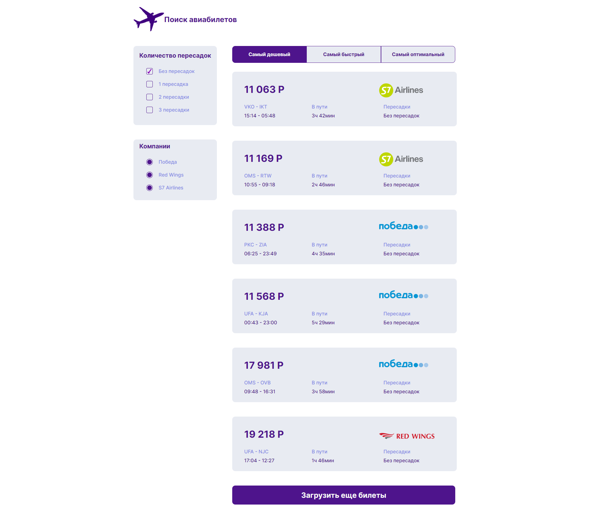

Ваш обновленный README.md может выглядеть так:

```markdown
# Приложение для поиска авиабилетов

Это приложение было разработано с использованием React, Redux Toolkit и TypeScript. 



## Описание

Приложение для поиска авиабилетов позволяет пользователям быстро и удобно находить лучшие предложения от различных авиакомпаний. 

## Использованные технологии

- React
- Redux Toolkit
- TypeScript

## Установка и запуск

Для установки и запуска приложения выполните следующие шаги:

1. Клонируйте репозиторий: `git clone https://github.com/Nojotel/airlines.git`
2. Установите зависимости: `npm install`
3. Запустите приложение: `npm start`

Приложение будет доступно по адресу: `http://localhost:3000`


